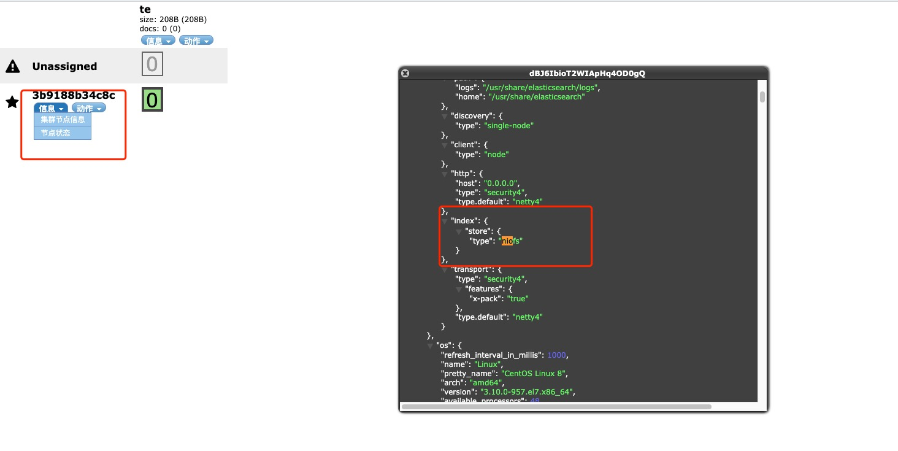

## es在实际使用时内存爬坡最终内存溢出的问题及解决

#### 1、关于elasticsearch内存持续增长的问题

当用户把数据写入到elasticsearch中，最终数据都会被落盘到本地的硬盘上，再根据用户对elasticsearch的`index.store.type`配置项，如果配置成mmapfs，那么elasticsearch会把落在盘上的所有数据映射到内存中。随着用户写入数据量的增多，落盘的数据也增多，那么内存占用就越来越大！映射硬盘数据的内存位于本地系统中，即不属于JVM的堆内存，也不属于MaxDirectMemorySize 控制的堆外内存。

#### 2、解决方案

修改`index.store.type`的配置即可，不要使用mmapfs的方式。改用niofs，niofs性能也很好，对检索的性能影响并不大，并且能够有效的控制内存增长。

具体不同版本的修改方式不一样：

这儿可以选择不同版本：https://www.elastic.co/guide/en/elasticsearch/reference/index.html

具体的某个版本的示范：https://www.elastic.co/guide/en/elasticsearch/reference/7.12/index-modules-store.html

配置好了，可以使用chrome的elasticsearch head插件，然后点击某个索引的`信息`按钮，找到`集群节点信息` ,查找index---store---type即可。

