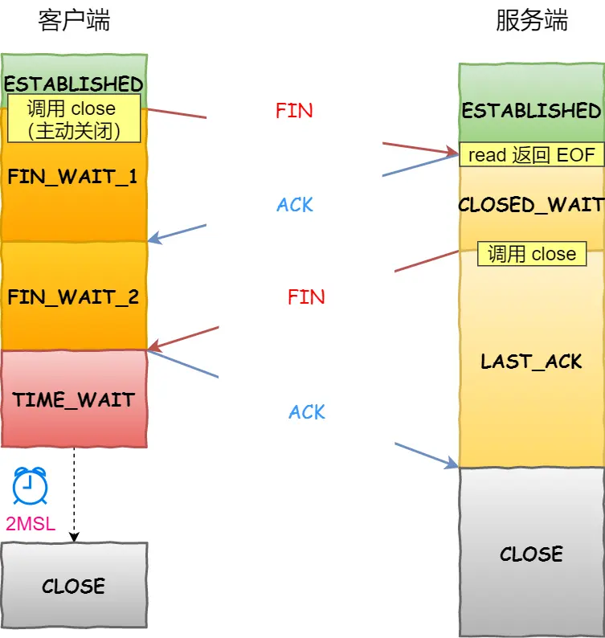

## Socket建立连接后，断开的流程是什么

- 客户端调用 `close`，表明客户端没有数据需要发送了，则此时会向服务端发送 FIN 报文，进入 FIN_WAIT_1 状态；
- 服务端接收到了 FIN 报文，TCP 协议栈会为 FIN 包插入一个文件结束符 `EOF` 到接收缓冲区中，应用程序可以通过 `read` 调用来感知这个 FIN 包。这个 `EOF` 会被**放在已排队等候的其他已接收的数据之后**，这就意味着服务端需要处理这种异常情况，因为 EOF 表示在该连接上再无额外数据到达。此时，服务端进入 CLOSE_WAIT 状态；
- 接着，当处理完数据后，自然就会读到 `EOF`，于是也调用 `close` 关闭它的套接字，这会使得服务端发出一个 FIN 包，之后处于 LAST_ACK 状态；
- 客户端接收到服务端的 FIN 包，并发送 ACK 确认包给服务端，此时客户端将进入 TIME_WAIT 状态；
- 服务端收到 ACK 确认包后，就进入了最后的 CLOSE 状态；
- 客户端经过 `2MSL` 时间之后，也进入 CLOSE 状态；